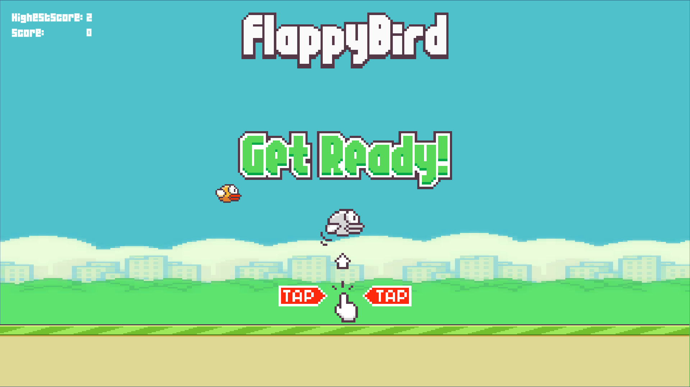

# 🐤 Flappy Bird Clone (Unity)

A simple Flappy Bird clone built with Unity 2D as a portfolio project.

## 🎮 Gameplay

- Press `Space` to make the bird flap
- Avoid pipes
- Score points for every pipe passed

## 🔧 Built With

- Unity Hub
- C#
- 2D Physics, Sprite Animation

## 📸 Screenshots

## 💼 Author

Nguyen Ba Quy — [GitHub](https://github.com/QuynbDev2k3)
